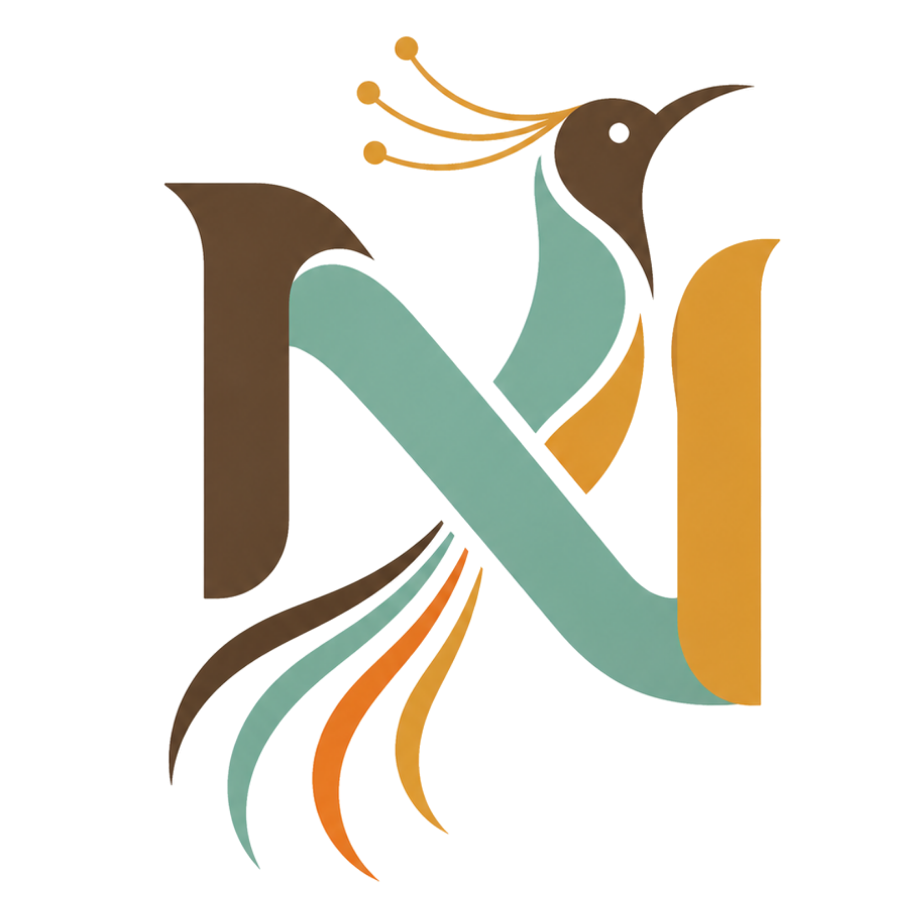

<div align="center">
  

  # Nokara Community

  **Platform Gerakan & Komunitas Talenta IT Timika, Papua**  
  *Bagian dari ekosistem digital [NOKARA.ID](https://nokara.id)*

</div>

---

## Tentang Nokara Community

Nokara Community adalah wadah kolaborasi, pembinaan, dan akselerasi talenta teknologi informasi (IT) yang berpusat di Timika, Papua Tengah. Komunitas ini diinisiasi oleh **Muhammad Amin Hidayat** sebagai wujud kontribusi nyata dalam membangun kedaulatan talenta digital dan literasi rekayasa perangkat lunak di kawasan Indonesia Timur.

Komunitas ini menjadi ruang temu bagi praktisi, pelajar, akademisi, dan pegiat industri kreatif untuk bertukar wawasan, membangun solusi digital terapan (*member showcase*), serta menjawab tantangan digitalisasi daerah berlandaskan filosofi kebersamaan Noken.

---

## Pilar Gerakan

1. **Pusat Edukasi & Literasi Digital**: Kurikulum belajar terarah, artikel teknis, dan lokakarya langsung untuk mendalami rekayasa web, arsitektur sistem, dan tata kelola sistem informasi.
2. **Karya & Portofolio Member**: Wadah pameran karya (*showcase*) untuk mendokumentasikan aplikasi nyata yang dibangun oleh anggota komunitas, mulai dari sistem informasi offline-first untuk UMKM lokal hingga manajemen jaringan daerah.
3. **Kopi Darat & Diskusi Terbuka**: Pertemuan berkala pegiat IT di Timika untuk membahas studi kasus nyata, bedah kode, dan perkembangan standar industri teknologi.
4. **Mentoring & Kolaborasi Industri**: Pendampingan intensif dari praktisi untuk mempersiapkan talenta lokal memasuki standar profesional industri teknologi modern.

---

## Stack Teknologi

Platform web Nokara Community dirancang dengan fondasi modern, ringan, dan cepat:

- **Framework**: [Astro](https://astro.build/) (Static Site Generation performa tinggi dan ramah SEO)
- **Styling**: Tailwind CSS dengan skema warna terkurasi (Solid Gold `#D4AF37` dan Dark Mode)
- **Konten**: Markdown & Content Collections untuk artikel teknis dan modul edukasi
- **Runtime / Package Manager**: Bun / Node.js
- **Pendekatan Rekayasa**: Arsitektur komponen modular, aksesibilitas tinggi, dan tanpa dependensi berlebih (prinsip *Ponytail*)

---

## Struktur Direktori

```plaintext
/
├── public/                # Aset statis publik (Logo, Favicon, OpenGraph)
│   ├── Logo-Nokara-light.png
│   └── favicon.svg
├── src/
│   ├── assets/            # Aset visual internal dan ilustrasi
│   ├── components/
│   │   ├── blocks/        # Komponen blok per bagian halaman (Hero, CTA, Form)
│   │   └── ui/            # Komponen atomik antarmuka (Button, Badge, Modal)
│   ├── config/            # Konfigurasi navigasi, SEO, dan data sosial
│   ├── content/
│   │   └── blog/          # Artikel edukasi dan wawasan IT Timika (Markdown)
│   ├── data/              # Sumber data terstruktur (FAQ, testimoni)
│   ├── icons/             # Koleksi ikon SVG
│   ├── layouts/           # Tata letak dasar halaman
│   └── pages/             # Rute dan halaman web (Astro file-based routing)
├── package.json
└── astro.config.mjs
```

---

## Panduan Menjalankan Project

### Prasyarat

Pastikan salah satu runtime berikut telah terpasang:
- [Bun](https://bun.sh/) (Direkomendasikan) atau
- [Node.js](https://nodejs.org/) versi 20 ke atas

### Instalasi & Menjalankan Server Lokal

1. **Clone repositori**:
   ```bash
   git clone https://github.com/nokara-core/nokara.git
   cd nokara-side-company
   ```

2. **Pasang dependensi**:
   ```bash
   bun install
   # atau jika menggunakan npm:
   # npm install
   ```

3. **Jalankan server pengembangan**:
   ```bash
   bun dev
   # atau:
   # npm run dev
   ```
   Aplikasi dapat diakses melalui browser di `http://localhost:4321`.

4. **Build untuk produksi**:
   ```bash
   bun run build
   # atau:
   # npm run build
   ```
   Hasil kompilasi statis akan dihasilkan di direktori `./dist/`.

---

## Konfigurasi Penting

- **Navigasi Atas**: Dikelola melalui `src/config/navigationBar.ts`.
- **Navigasi Footer**: Dikelola melalui `src/config/footerNavigation.ts`.
- **SEO & Metadata**: Dikelola melalui `src/config/config.ts`.
- **FAQ Komunitas**: Dikelola melalui `src/data/json-files/faqData.json`.

---

## Kontak & Partisipasi

- **WhatsApp Komunitas**: [+62 882-4276-3942](https://wa.me/6288242763942)
- **Email Resmi**: [contact@nokara.id](mailto:contact@nokara.id)
- **Portal Induk**: [https://nokara.id](https://nokara.id)
- **Pusat Gerakan**: Timika, Kabupaten Mimika, Papua Tengah, Indonesia

---

## Lisensi & Atribusi

Dikembangkan untuk ekosistem **Nokara Community** oleh **Muhammad Amin Hidayat** (Founder NOKARA.ID).  
Hak Cipta Dilindungi Undang-Undang.
